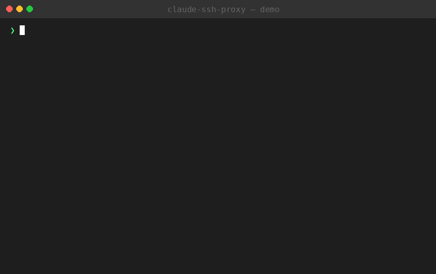

# ai-coding-ssh

> [中文版](./README.md)

[](https://claude.ai)
[](https://code.claude.com)
[](./LICENSE)



Use **Claude Code**, **Gemini CLI**, and **Codex CLI** on remote intranet Linux servers that have **no public IP and no internet access**.

By leveraging SSH reverse tunnels, the local API proxy port on your Mac is "carried into" the remote server, allowing AI coding tools to reach their respective APIs through `localhost`.

## Features

- **Multi-AI tool support** — Supports Claude Code (Anthropic), Gemini CLI (Google), and Codex CLI (OpenAI) simultaneously
- **Zero compilation, pure source code** — Shell scripts + Node.js source only, no binaries, fully readable and auditable
- **One-command connection** — `ai-ssh user@server` auto-starts proxy, creates SSH tunnel, and configures remote env
- **SSE streaming support** — Full Server-Sent Events passthrough for streaming output
- **Multi-server reuse** — A single proxy instance can serve multiple SSH tunnels simultaneously
- **Optional authentication** — Token-based auth for team sharing scenarios
- **Unified gateway** — Route all AI providers through a single gateway via `PROXY_UPSTREAM`
- **Offline installation** — Install Claude Code CLI on air-gapped servers with no internet

## How It Works

```
Remote Intranet Server               Developer's Mac
┌──────────────────────┐           ┌──────────────────────────────┐
│  Claude Code CLI     │           │  API Proxy (:18080)          │
│  Gemini CLI          │           │    ↓ Routing:                │
│  Codex CLI           │           │    /*        → anthropic.com │
│    ↓                 │           │    /gemini/* → googleapis    │
│  localhost:18080  ───┼── SSH-R ──┼→   /openai/* → openai.com   │
│                      │  tunnel   │                              │
└──────────────────────┘           └──────────────────────────────┘
```

When you SSH into the remote server, the `-R` (reverse port forwarding) flag maps your local proxy port to `localhost:18080` on the remote machine. AI coding tools on the remote server use environment variables (`ANTHROPIC_BASE_URL`, `GOOGLE_GEMINI_BASE_URL`, `OPENAI_BASE_URL`) pointing to that address. All API requests travel back through the SSH tunnel to the local proxy, which routes them by path prefix to the corresponding API provider.

## Project Structure

```
ai-coding-ssh/
├── bin/
│   ├── ai-ssh                 # Core connection script (Bash)
│   └── ai-ssh-install-remote  # Remote installation helper (Bash)
├── lib/
│   └── proxy.mjs                  # Multi-provider API proxy server (Node.js, pure source)
├── test/
│   └── test-proxy.mjs             # Automated test suite
├── setup.sh                       # Local one-click install script
├── package.json
├── LICENSE
├── README.md                      # Chinese documentation
└── README_EN.md                   # English documentation
```

All code consists of **readable source files** with no compiled artifacts or binary dependencies. Shell scripts run directly; the Node.js proxy is a single-file ES Module requiring no `npm install`.

## Quick Start

### 1. Install (on your Mac)

```bash
git clone https://github.com/Heliner/ai-coding-ssh.git
cd ai-coding-ssh
bash setup.sh
```

Or use directly without installation:

```bash
# Run directly from the project directory
./bin/ai-ssh user@server
```

### 2. Install Claude Code on the Remote Server

```bash
# Online install (remote server needs npm registry access)
ai-ssh --install-remote user@server

# Offline install (remote server has no internet)
ai-ssh-install-remote --offline user@server
```

### 3. Connect and Use

```bash
ai-ssh user@server
```

Once on the remote server, just run `claude`. Environment variables are already configured.

## Prerequisites

**Local Mac:**

- Node.js >= 18
- SSH client

**Remote Server:**

- Node.js >= 18 (required by Claude Code CLI)
- SSH Server (default localhost binding is sufficient)

## Command Reference

### `ai-ssh`

Core command. Automatically starts local proxy, establishes SSH connection, creates reverse tunnel, and configures remote environment variables.

```bash
# Basic usage
ai-ssh user@192.168.1.100

# Custom ports
ai-ssh -p 9090 -r 9090 user@server

# Use SSH key
ai-ssh -i ~/.ssh/id_ed25519 user@server

# Custom SSH port
ai-ssh -P 2222 user@server

# With auth token (for team sharing)
ai-ssh -t my-secret-token user@server

# Extra SSH args (e.g., port forwarding)
ai-ssh user@server -- -L 3000:localhost:3000

# Keep proxy running after disconnect (useful for multiple servers)
ai-ssh -k user@server1
ai-ssh --no-proxy user@server2  # reuse existing proxy
```

### `ai-ssh-install-remote`

Install Claude Code CLI on the remote server.

```bash
# Online install
ai-ssh-install-remote user@server

# Offline install (pack local npm package and transfer via scp)
ai-ssh-install-remote --offline user@server
```

### Proxy Server (standalone)

```bash
# Start proxy directly
node lib/proxy.mjs

# Custom configuration
node lib/proxy.mjs --port 9090 --token my-token --debug

# Unified gateway mode (route all providers to one address)
node lib/proxy.mjs --upstream https://api.aicoding.sh

# Health check
curl http://localhost:18080/__health

# Run tests
npm test
```

## Environment Variables

| Variable | Description | Default |
|----------|-------------|---------|
| `AI_SSH_PROXY_PORT` | Local proxy port | 18080 |
| `AI_SSH_REMOTE_PORT` | Remote tunnel port | 18080 |
| `AI_SSH_PROXY_TOKEN` | Proxy auth token | none |
| `PROXY_UPSTREAM` | Unified gateway URL (overrides all provider routing) | none |
| `ANTHROPIC_API_KEY` | Anthropic API Key | none (auto-forwarded to remote) |
| `GEMINI_API_KEY` | Google Gemini API Key | none (auto-forwarded to remote) |
| `OPENAI_API_KEY` | OpenAI API Key | none (auto-forwarded to remote) |

## Common Scenarios

### Scenario 1: Connect to a Single Intranet Server

```bash
ai-ssh dev@10.0.1.50
# Then just use claude
```

### Scenario 2: Connect to Multiple Servers (shared proxy)

```bash
# Terminal 1: connect to first server, -k keeps proxy running
ai-ssh -k dev@server1

# Terminal 2: connect to second server, --no-proxy reuses proxy
ai-ssh --no-proxy dev@server2
```

### Scenario 3: Jump Host (multi-hop SSH)

```bash
# Connect to target through a bastion/jump server
ai-ssh dev@target -- -J jump@bastion
```

### Scenario 4: Air-Gapped Environment (no internet at all)

```bash
# First, offline install Claude Code
ai-ssh-install-remote --offline dev@airgapped-server

# Then connect normally
ai-ssh dev@airgapped-server
```

## Troubleshooting

**Proxy fails to start:** Check `/tmp/ai-coding-ssh.log`

**Remote claude reports connection refused:** Verify tunnel ports match, check with `ss -tlnp | grep 18080`

**SSE streaming not working:** Ensure Node.js >= 18; the proxy disables response buffering by default

**Port already in use:** Switch to a different port: `ai-ssh -p 19090 -r 19090 user@server`

## Acknowledgments

This project was developed with assistance from [Claude](https://claude.ai) AI. Architecture design, code implementation, and documentation were all completed through AI collaboration.

## License

MIT
